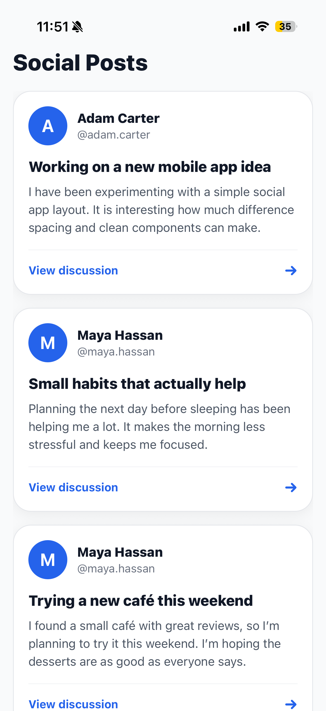
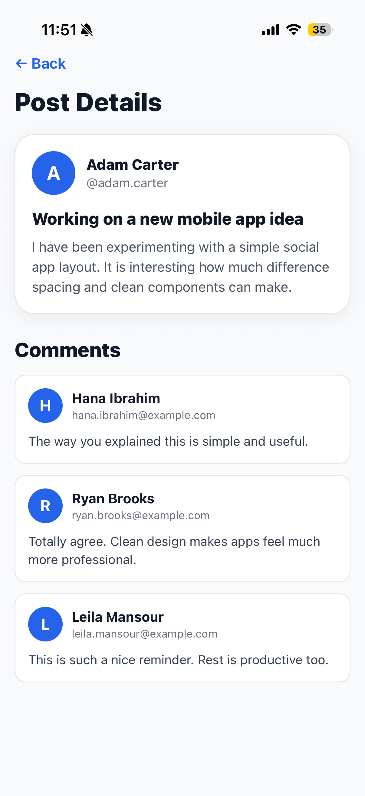

# Social Posts App

A sample social mobile application built with **Expo Go**, **React Native**, and **TypeScript**.

The app displays a list of social posts and allows the user to open a post details screen to view the selected post with its comments.

## Features

* Home screen with a list of posts
* Post cards showing:

  * User name
  * Circular avatar using the first letter of the user’s name
  * Post title
  * Post content
* Post Details screen showing:

  * Selected post at the top
  * List of comments below the post
* Comment cards showing:

  * User name
  * Circular avatar
  * Comment content
* Navigation between screens using Expo Router
* Loading and error states for API requests
* Clean and mobile-friendly UI

## APIs Used

The app uses the GoREST public API.

### Posts

```text
https://gorest.co.in/public/v2/posts
```

### Post Comments

```text
https://gorest.co.in/public/v2/posts/{postId}/comments
```

### Users

```text
https://gorest.co.in/public/v2/users/{userId}
```

The posts endpoint only returns `user_id`, so the app fetches the user separately using the users endpoint.

Since GoREST does not provide avatar images, the app creates a circular avatar using the first letter of the user’s name.

## Screenshots

### Home Screen



### Post Details Screen



## Project Structure

```text
app/
  _layout.tsx
  index.tsx
  post/
    [id].tsx

src/
  api/
    gorest.ts
  components/
    Avatar.tsx
    PostCard.tsx
    CommentCard.tsx
  types/
    index.ts

screenshots/
  home-screen.png
  post-details-screen.png
```

## How to Run the Project

### 1. Clone the repository

```bash
git clone https://github.com/mariaawadd/SOCIAL-POSTS-APP.git
```

### 2. Go into the project folder

```bash
cd SOCIAL-POSTS-APP
```

### 3. Install dependencies

```bash
npm install
```

### 4. Start the Expo development server

```bash
npx expo start
```

### 5. Run on mobile

Open **Expo Go** on your phone and scan the QR code.

## Technical Decisions

* I used **Expo Router** to handle navigation between the Home screen and the Post Details screen.
* I used **TypeScript types** to make the structure of posts, users, and comments clear.
* I created reusable components for the avatar, post card, and comment card.
* I used separate API functions in `src/api/gorest.ts` to keep the API logic away from the UI screens.
* Since GoREST does not provide avatars, I used the first letter of each user’s name inside a circular avatar.
* Since GoREST returns generated placeholder text, the app normalizes the displayed demo content to make the UI look cleaner and more realistic while still using the required API flow.

## Time Taken

Approximately 1 hour.

## Author

Maria Awad
